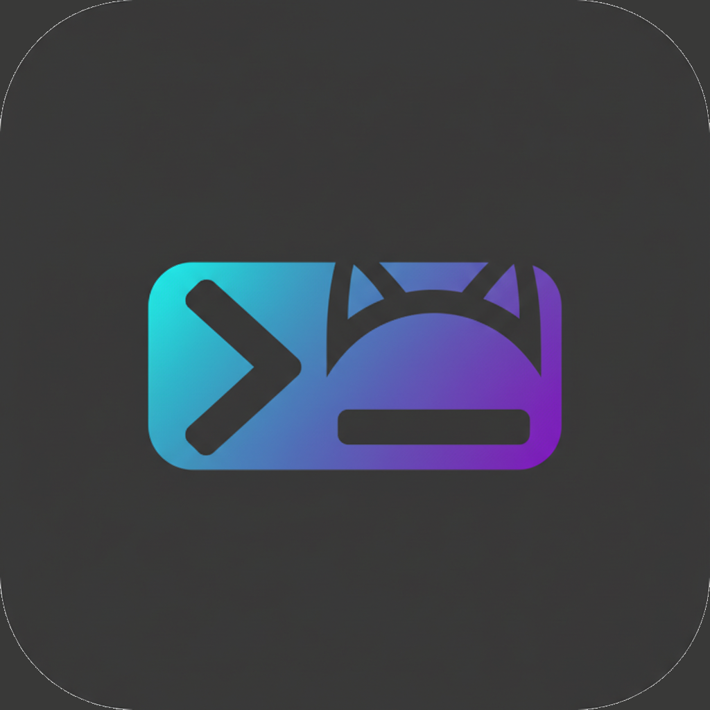

# Termikita

A native macOS terminal emulator built with Python and AppKit. Renders text with CoreText for crisp, Retina-quality output — no Electron, no web views.

<p align="center">
  
</p>

## Highlights

- **Native macOS rendering** — CoreText + AppKit, same drawing path as Terminal.app
- **Retina-sharp text** — subpixel positioning, no layer-backed blurring
- **Full Unicode & Vietnamese IME** — NFC normalization, Telex/VNI input via NSTextInputClient
- **256-color & 24-bit truecolor** — `TERM=xterm-256color`, `COLORTERM=truecolor`
- **Multi-tab, multi-window** — independent sessions with per-tab PTY processes
- **9 color themes** — Dracula, Nord, Solarized, Gruvbox, One Dark, Catppuccin Mocha, and more — switch from View menu
- **Nerd Font support** — auto-detects installed Nerd Fonts, PUA glyph isolation
- **Finder integration** — right-click "Open in Termikita", drag folders to dock icon, `termikita://` URL scheme
- **Dock bounce & notifications** — alerts when long-running commands finish in background

---

## Installation

### Build from source

```bash
# Clone & setup
git clone https://github.com/kitara2005/termikita.git
cd termikita
python3 -m venv .venv
source .venv/bin/activate
pip install -e ".[build]"

# Run directly
python -m termikita

# Build .app bundle
python setup.py py2app        # → dist/Termikita.app

# Build DMG installer
bash build-dmg.sh             # → dist/Termikita.dmg
```

**Requirements:** Python 3.12+, macOS 13.0 (Ventura) or later.

---

## Features

### Multi-Tab & Multi-Window

Each tab runs its own shell process with a dedicated PTY. Tabs display titles from `OSC 2` escape sequences. Multiple windows supported with cascading placement.

| Shortcut | Action |
|---|---|
| `Cmd+T` | New tab |
| `Cmd+N` | New window |
| `Cmd+W` | Close tab |
| `Cmd+1`–`9` | Switch to tab by number |
| `Cmd+Shift+]` | Next tab |
| `Cmd+Shift+[` | Previous tab |

### Text Rendering

CoreText renders each line as grouped `CTLine` runs — the same API that powers TextEdit and Xcode. No layer-backed views means no scaling artifacts on Retina displays.

- **Font variants:** bold, italic, bold-italic synthesized via NSFontManager
- **Font cascade:** primary font → Nerd Font (auto-detected) → Lucida Grande → LastResort
- **Block elements:** pixel-snapped box drawing and block art (█▄▀─│├┘)
- **Decorations:** underline, strikethrough rendered at subpixel precision

### Font Selection & Zoom

Open the system font panel from **Format → Font → Show Fonts** or use keyboard shortcuts:

| Shortcut | Action |
|---|---|
| `Cmd+=` | Zoom in (+1pt) |
| `Cmd+-` | Zoom out (-1pt) |
| `Cmd+0` | Reset to default size |

Font range: 8pt – 36pt. Changes persist across sessions.

### Color Themes

9 bundled themes. Switch instantly from **View → Theme** — active theme has a checkmark. Choice persists across sessions.

| Theme | Style |
|---|---|
| `default-dark` | Light gray on dark — the default |
| `default-light` | Dark text on light background |
| `dracula` | Purple-accented dark theme |
| `nord` | Arctic, blue-tinted palette |
| `solarized-dark` | Ethan Schoonover's dark variant |
| `solarized-light` | Ethan Schoonover's light variant |
| `gruvbox-dark` | Retro warm dark theme |
| `one-dark` | Atom One Dark |
| `catppuccin-mocha` | Pastel dark, warm tones |

Custom themes: add a `.json` file to `themes/` when running from source. In built `.app` bundles, themes are inside `Resources/themes/`.

### Cursor

Three cursor styles with blinking support:

- **Block** — filled rectangle (default)
- **Beam** — vertical I-beam
- **Underline** — bottom line

Cursor shape is controlled by applications via `DECSCUSR` escape sequences. Cursor visibility (`DECTCEM`) is strictly respected — TUI frameworks like Ink/Claude Code that hide the terminal cursor and render their own work correctly.

### Terminal Emulation

Full VT100/xterm emulation via [pyte](https://github.com/selectel/pyte):

- **Colors:** 16 ANSI, 256 indexed, 24-bit RGB (`SGR 38;2;r;g;b`)
- **Attributes:** bold, italic, underline, reverse video, strikethrough
- **Alternate screen:** DECSET/DECRST 1049 with scrollback save/restore
- **Terminal queries:** DA1 (device attributes), DSR (cursor position report)
- **Hyperlinks:** OSC 8 stored per-cell
- **Window title:** OSC 2 updates tab and window title
- **Synchronized output:** DEC 2026 support

### Scrollback

100,000 lines by default (configurable). Scrollback is frozen while alternate-screen apps (vim, less, htop) are active — no stale output mixed in.

- Mouse wheel scrolls history in normal mode
- Mouse wheel sends arrow keys in alternate screen mode (vim/less navigation)
- Scroll position stays stable when new output arrives

### Copy, Paste & Selection

| Shortcut | Action |
|---|---|
| `Cmd+C` | Copy selection (or send interrupt if no selection) |
| `Cmd+V` | Paste from clipboard |
| `Cmd+A` | Select all visible lines |
| Mouse drag | Select text region |

Pasting images from clipboard saves to a temp file and inserts the path — useful for quick file references.

### Right-Click Context Menu

- Copy / Paste / Select All
- Clear Buffer
- New Tab / Close Tab

### Finder Integration

**Services menu** (right-click in Finder):
- "New Termikita Tab Here" — opens tab at selected folder
- "New Termikita Window Here" — opens window at selected folder

**Drag & drop:** Drag a folder onto the Termikita dock icon to open a tab there.

**URL scheme:**
```bash
open "termikita:///Users/me/projects/myapp"
```

**Command line:**
```bash
termikita --dir /path/to/folder
# or simply:
termikita /path/to/folder
```

### Background Notifications

When Termikita is not the active app:

- **Dock bounce** — continuous bounce until you click the icon
- **macOS notification** — banner with "Command completed"

Triggered by:
- TUI app exits (Claude Code, vim, etc.) — most reliable signal
- Shell output after prolonged silence (command likely finished)
- BEL character (`\a`)

---

## Configuration

Settings are stored in `~/.config/termikita/config.json`:

```json
{
  "font_family": "SF Mono",
  "font_size": 13.0,
  "theme": "default-dark",
  "scrollback_lines": 100000,
  "window_width": 800,
  "window_height": 500,
  "shell": ""
}
```

| Key | Default | Description |
|---|---|---|
| `font_family` | `"SF Mono"` | Monospace font name |
| `font_size` | `13.0` | Font size in points (8–36) |
| `theme` | `"default-dark"` | Theme name (see [Color Themes](#color-themes)) |
| `scrollback_lines` | `100000` | Maximum scrollback buffer lines |
| `window_width` | `800` | Initial window width (px) |
| `window_height` | `500` | Initial window height (px) |
| `shell` | `""` | Shell path; empty = `$SHELL` or `/bin/zsh` |

---

## Architecture

```
┌─────────────────────────────────────────┐
│              AppDelegate                │  Cocoa lifecycle, menu bar, Services
├──────────┬──────────────────────────────┤
│ TabBar   │       TabController          │  Multi-tab orchestration
├──────────┴──────────────────────────────┤
│              TerminalView               │  NSView + NSTextInputClient
│  ┌─────────────────┬──────────────────┐ │
│  │  DrawMixin      │  InputMixin      │ │  drawRect_, mouse, keyboard, IME
│  └────────┬────────┴──────────────────┘ │
├───────────┼─────────────────────────────┤
│     TextRenderer + CellDrawHelpers      │  CoreText CTLine, glyph atlas
├───────────┼─────────────────────────────┤
│    TerminalSession                      │  Owns PTY + Buffer
│  ┌────────┴────────┬──────────────────┐ │
│  │  PTYManager     │  BufferManager   │ │  Fork/exec, pyte VT100 parser
│  └─────────────────┴──────────────────┘ │
└─────────────────────────────────────────┘
```

- **PTY read thread** feeds data into BufferManager (pyte). Main thread polls a dirty flag at 60 fps — no cross-thread ObjC calls.
- **CoreText** renders each line as style-grouped CTLine runs. PUA characters (Nerd Font icons) are isolated into single-cell runs to prevent grid displacement.
- **No `setWantsLayer_(True)`** — layer-backed views cause blurry text on Retina. Termikita draws directly like native Terminal.app.

---

## Environment Variables

Termikita sets these for child processes:

| Variable | Value |
|---|---|
| `TERM` | `xterm-256color` |
| `COLORTERM` | `truecolor` |
| `LANG` | `en_US.UTF-8` (if not already set) |
| `PROMPT_EOL_MARK` | `""` (suppresses zsh `%`) |

---

## Nerd Fonts

Termikita auto-detects installed Nerd Fonts via NSFontManager and adds them to the font cascade. If no Nerd Font is installed, PUA characters (U+E000–U+F8FF) fall back to LastResort.

For full icon support:

```bash
brew install font-symbols-only-nerd-font
```

---

## Development

```bash
# Setup
python3 -m venv .venv
source .venv/bin/activate
pip install -e ".[dev,build]"

# Run from source
python -m termikita

# Lint
ruff check src/

# Type check
mypy src/termikita/
```

### Project Structure

```
src/termikita/
├── __main__.py              # Entry point
├── app_delegate.py          # NSApplicationDelegate, menu bar, Services
├── main_window.py           # NSWindow setup
├── tab_controller.py        # Tab lifecycle, font zoom, dock bounce
├── tab_bar_view.py          # Tab strip rendering
├── terminal_view.py         # NSView subclass, ObjC selector forwarding
├── terminal_view_draw.py    # drawRect_, refresh timer, scroll wheel
├── terminal_view_input.py   # NSTextInputClient, mouse, clipboard, context menu
├── terminal_session.py      # PTY + Buffer orchestrator
├── pty_manager.py           # PTY fork/exec, I/O thread
├── buffer_manager.py        # pyte Screen, scrollback, VT100 parsing
├── text_renderer.py         # CoreText rendering, font metrics
├── cell_draw_helpers.py     # CTLine drawing, block elements, decorations
├── glyph_atlas.py           # LRU glyph cache with font fallback
├── color_resolver.py        # ANSI → RGB resolution (256 + 24-bit)
├── color_utils.py           # Hex/RGB conversion
├── theme_manager.py         # Theme loading from JSON
├── config_manager.py        # ~/.config/termikita/config.json
├── input_handler.py         # Key code → escape sequence mapping
├── unicode_utils.py         # NFC normalization
├── constants.py             # App-wide defaults
└── block_element_renderer.py # Box drawing & block art
```

---

## License

MIT
